# Procurement Spend and Cost Analysis

An Excel workbook that turns a year of purchase order data into a spend analysis: where the money went, which departments and categories drive it, how it moved month to month, and how exposed the business is to concentration risk. The workbook is built on a Power Pivot data model, reports through pivot tables and slicers, and finishes in a single-page dashboard with eight charts and a short list of actions.

The headline numbers: **$12.61M** spent across **30 purchase orders** and **461 units**, with **68.7%** of it going to one category (Raw Materials) and **90.4%** landing in two departments (Supply Chain and Production).

The workbook is in [`data/Spend_Cost_Analysis.xlsx`](data/Spend_Cost_Analysis.xlsx). Every screenshot below lives in [`screenshots/`](screenshots/).

## Contents

- [What is in the workbook](#what-is-in-the-workbook)
- [The data model](#the-data-model)
- [Dashboard](#dashboard)
- [Details sheet](#details-sheet)
- [Pivot tables (Sheet2)](#pivot-tables-sheet2)
- [Dashboard Data sheet](#dashboard-data-sheet)
- [Key findings](#key-findings)
- [How the pieces connect](#how-the-pieces-connect)
- [How to use the file](#how-to-use-the-file)
- [Repository layout](#repository-layout)

## What is in the workbook

There are four sheets, and each has a different job.

| Sheet | Purpose |
| --- | --- |
| Dashboard | The finished, single-page view: six KPI cards, five charts and eight written insights. |
| Details | The supporting tables behind the charts, plus concentration and risk indicators and a short key-metrics list. |
| Sheet2 | The working pivot tables, three pivot charts and four slicers. Everything else is linked back to this sheet. |
| Dashboard Data | The calculation layer. It reads from the pivot tables and reshapes the numbers into the exact ranges the dashboard charts need. |

## The data model

The raw purchase data is not sitting on a worksheet. It lives in an embedded Power Pivot model built from five Power Query connections, arranged as a star schema: one fact table of purchase orders in the middle and four dimension tables around it.

- **PO_Fact** holds the purchase order lines, meaning what was bought, from whom, when and for which department.
- **Dim_Calendar** gives each date a year, quarter, month number, month name, week number, day name and a weekend flag.
- **Dim_Department** lists the departments with a department ID, cost center code, budget owner and annual budget.
- **Dim_Item** describes each item by ID, name, category, sub-category, unit of measure and standard unit price.
- **Dim_Vendor** describes each supplier by ID, name, category, region, approval status, contract start and end dates, payment terms in days and a strategic/leverage/bottleneck/tail segment.

Five measures sit on top of the model and feed the pivot tables: **Total Spend**, **Total Order**, **Total Order QTY**, **Avg. Order QTY** and **Per Order Value** (spelled "Per Order Vlue" in the pivot header). Because the pivots, charts and slicers all read from one model, a change to a slicer or a refresh of the data moves every number at once.

## Dashboard

The dashboard is the page meant to be read first. It is laid out top to bottom: headline numbers, then the spend trend, then the category and department mix, then concentration, then the written insights.

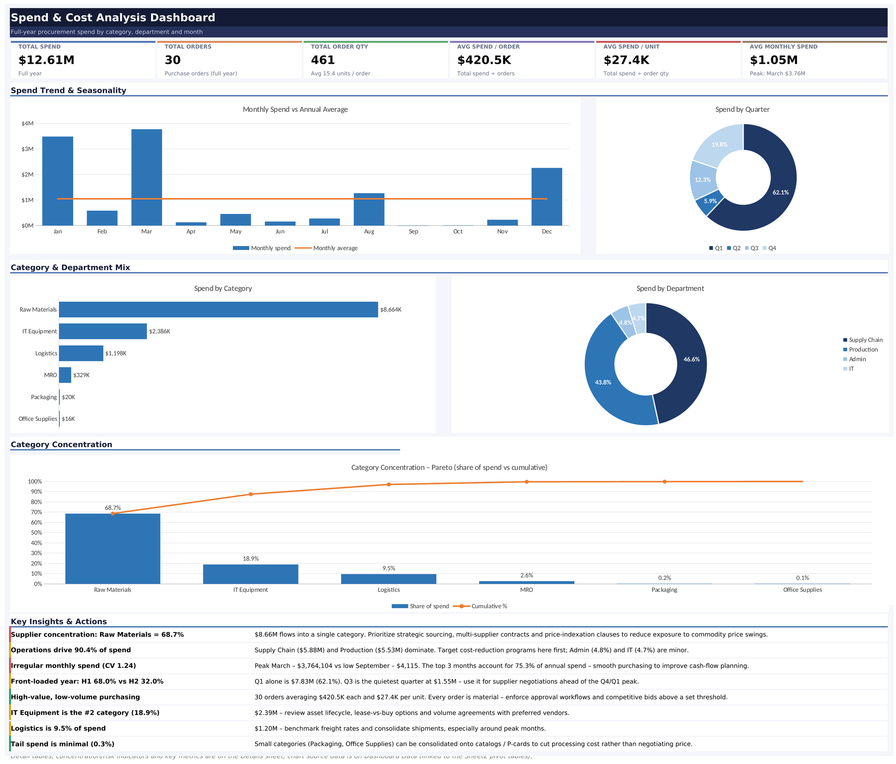

### KPI cards

Six cards run across the top and answer the first questions anyone asks about a spend report.

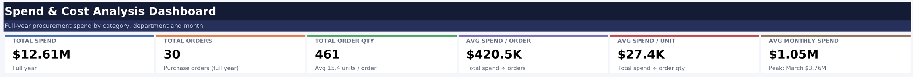

- **Total spend: $12.61M.** The full-year figure, and the number every share on the dashboard is measured against.
- **Total orders: 30.** Purchase orders raised over the year.
- **Total order qty: 461.** Units ordered, which works out to about 15.4 units per order.
- **Avg spend per order: $420.5K.** Total spend divided by order count. The figure is large because the orders are few and big.
- **Avg spend per unit: $27.4K.** Total spend divided by total order quantity.
- **Avg monthly spend: $1.05M.** The yearly total spread evenly across twelve months. The card notes that March was the peak at $3.76M, which shows how far the real months sit from this average.

### Monthly spend vs annual average

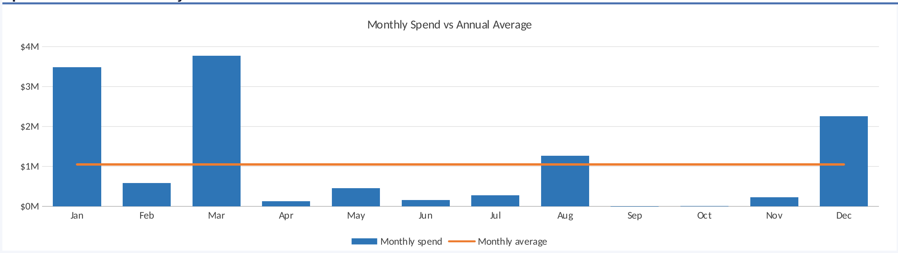

A column chart of spend in each month, with a flat orange line at the $1.05M monthly average. It shows the shape of the year quickly. January ($3.48M), March ($3.76M) and December ($2.25M) tower over the average line, August ($1.27M) just clears it, and the other eight months sit well below it. September ($4,115) and October ($10,324) are close to zero. Spend here is lumpy and driven by a few large orders rather than steady buying.

### Spend by quarter

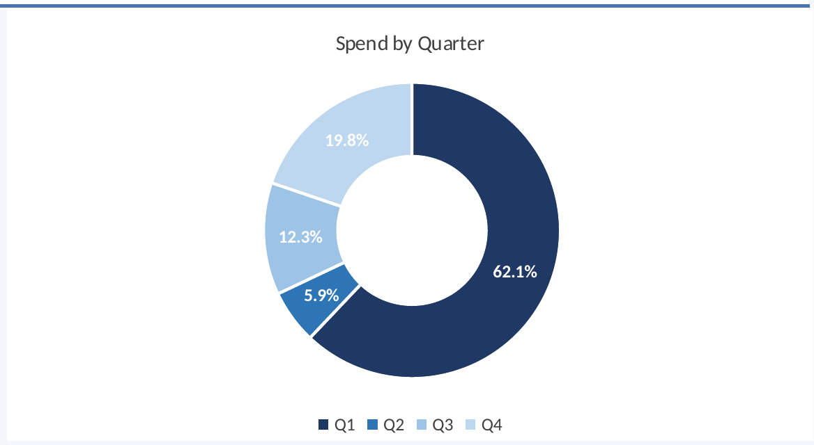

A donut chart splitting the year into quarters. Q1 takes **62.1%** ($7.83M), Q4 takes 19.8% ($2.50M), Q3 takes 12.3% ($1.55M) and Q2 is only 5.9% ($0.74M). The business buys most of what it needs at the start of the year and then again at the end, with a long quiet stretch in between.

### Spend by category

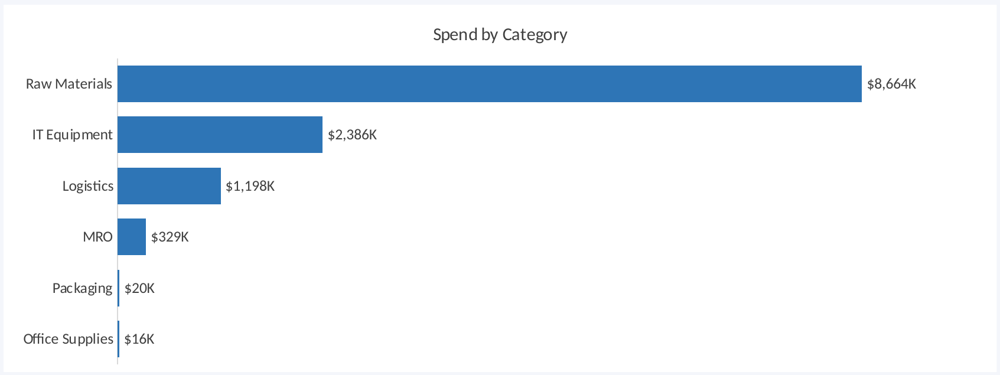

A horizontal bar chart ranking the six categories from largest to smallest, with the dollar value labelled on each bar.

| Category | Spend |
| --- | --- |
| Raw Materials | $8,664K |
| IT Equipment | $2,386K |
| Logistics | $1,198K |
| MRO | $329K |
| Packaging | $20K |
| Office Supplies | $16K |

Raw Materials alone is more than three times the size of the next category.

### Spend by department

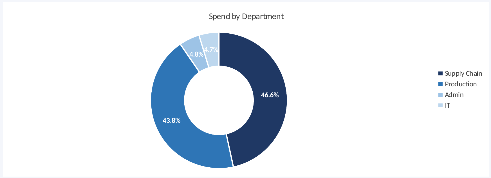

A donut chart of spend by the four departments. Supply Chain leads with **46.6%** ($5.88M), Production follows with **43.8%** ($5.53M), and Admin (4.8%, $0.61M) and IT (4.7%, $0.60M) share the remainder. Two departments account for nine of every ten dollars.

### Category concentration (Pareto)

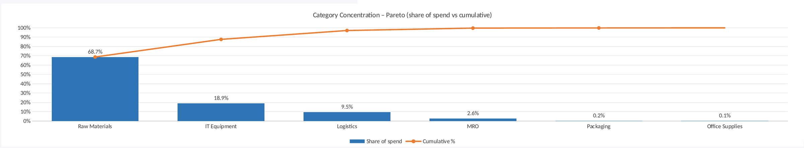

A Pareto chart: blue bars show each category's share of spend, and the orange line shows the running cumulative share. Raw Materials is 68.7% on its own. Adding IT Equipment brings the line to 87.6%, and Logistics takes it to 97.1%. The last three categories (MRO, Packaging and Office Supplies) together add under three points. The classic 80/20 pattern is here in a stronger form, since roughly 70% of spend sits in a single line.

### Key insights and actions

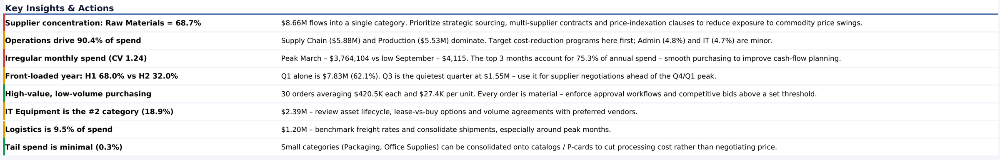

The bottom of the dashboard turns the charts into eight plain-language takeaways, each paired with a suggested action and a coloured marker for priority.

1. **Supplier concentration, Raw Materials at 68.7%.** $8.66M flows into one category. The suggestion is strategic sourcing, multi-supplier contracts and price-indexation clauses to soften commodity price swings.
2. **Operations drive 90.4% of spend.** Supply Chain and Production dominate, so cost-reduction work should start there. Admin and IT are minor.
3. **Irregular monthly spend (CV 1.24).** March peaked at $3,764,104 against a September low of $4,115, and the top three months make up 75.3% of the year. Smoother purchasing would help cash-flow planning.
4. **Front-loaded year, H1 68.0% vs H2 32.0%.** Q1 alone is $7.83M. Q3 is the quietest quarter at $1.55M, which makes it a good window for supplier negotiations ahead of the Q4 and Q1 peak.
5. **High-value, low-volume purchasing.** Thirty orders averaging $420.5K each means every order matters. The suggestion is approval workflows and competitive bids above a set threshold.
6. **IT Equipment is the second-largest category (18.9%).** At $2.39M it is worth reviewing asset lifecycle, lease-versus-buy options and volume agreements.
7. **Logistics is 9.5% of spend.** $1.20M is enough to justify benchmarking freight rates and consolidating shipments, especially around peak months.
8. **Tail spend is minimal (0.3%).** Packaging and Office Supplies could move to catalogs or purchasing cards to cut processing cost, since there is little price to negotiate.

## Details sheet

The Details sheet holds the tables behind the dashboard charts. Nothing on it is typed in by hand. Every figure links to the Dashboard Data sheet, which links to the pivot tables.

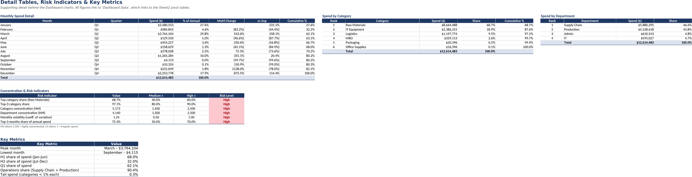

### Monthly spend detail

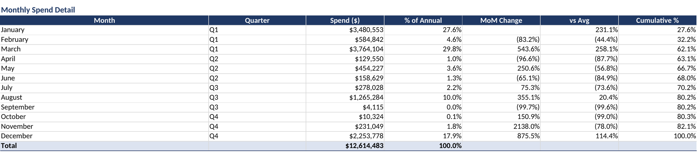

One row per month with its quarter, spend, share of the annual total, month-over-month change, difference from the monthly average and cumulative share. Two columns are worth reading closely. The **MoM change** column shows how violent the swings are: February fell 83.2% from January, March then jumped 543.6%, and November rose 2,138% off an October base of only $10,324. The **cumulative %** column shows that 62.1% of the year's spend is done by the end of March and 80.2% by the end of August, so the last four months add less than a fifth of the total even with December's $2.25M.

### Spend by category

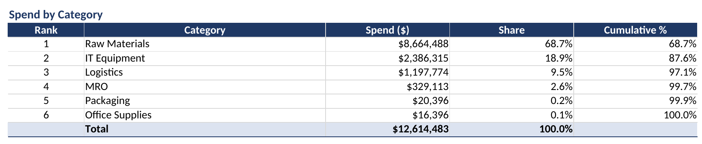

The six categories ranked by spend, with share and cumulative share. This is the table the Pareto chart is drawn from. The cumulative column crosses 80% at the second row and 97% at the third.

### Spend by department

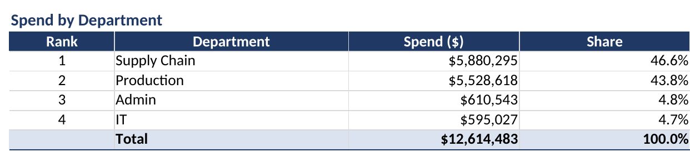

The four departments ranked by spend with their share. Supply Chain and Production together account for $11.41M of the $12.61M total.

### Concentration and risk indicators

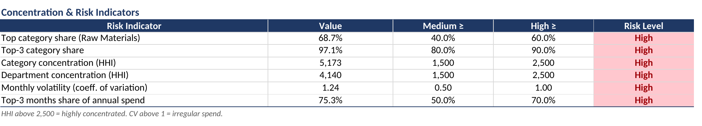

Six indicators, each compared against a medium and a high threshold, with the risk level coloured automatically.

| Indicator | Value | Medium at | High at | Level |
| --- | --- | --- | --- | --- |
| Top category share (Raw Materials) | 68.7% | 40% | 60% | High |
| Top-3 category share | 97.1% | 80% | 90% | High |
| Category concentration (HHI) | 5,173 | 1,500 | 2,500 | High |
| Department concentration (HHI) | 4,140 | 1,500 | 2,500 | High |
| Monthly volatility (coefficient of variation) | 1.24 | 0.50 | 1.00 | High |
| Top-3 months share of annual spend | 75.3% | 50% | 70% | High |

HHI is the Herfindahl-Hirschman Index, the sum of squared percentage shares. Anything above 2,500 counts as highly concentrated, and both category and department spend are well past that line. A coefficient of variation above 1 means irregular spend. All six indicators land on High, which is the single clearest summary of the analysis.

### Key metrics

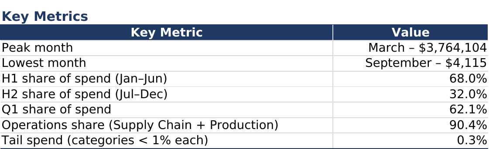

A short reference list: peak month (March, $3,764,104), lowest month (September, $4,115), H1 share 68.0%, H2 share 32.0%, Q1 share 62.1%, operations share 90.4% and tail spend 0.3%.

## Pivot tables (Sheet2)

Sheet2 is where the analysis starts. It holds four pivot tables that read from the data model, three pivot charts, and four slicers (Quarter, Year, Region and Vendor Name) that filter all of them together.

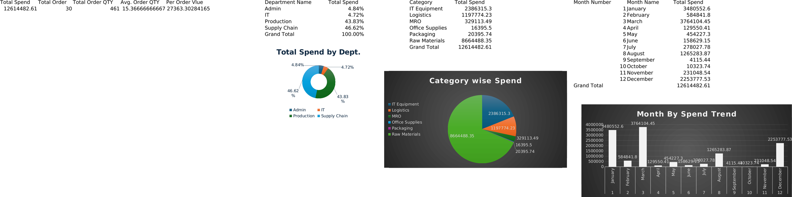

### Pivot 1: headline measures

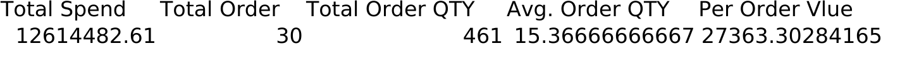

A single-row pivot with the five model measures side by side: Total Spend 12,614,482.61, Total Order 30, Total Order QTY 461, Avg. Order QTY 15.37 and Per Order Value 27,363.30. The last figure is total spend divided by total quantity, which is why it matches the Avg spend per unit card. This row feeds the KPI cards on the dashboard.

### Pivot 2: spend by department

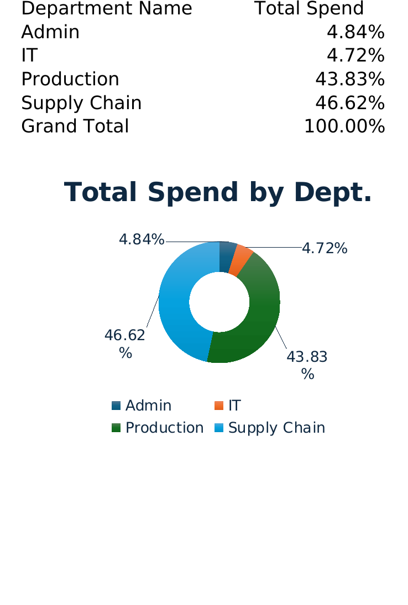

Department names down the rows, with Total Spend shown as a **percent of grand total** instead of a dollar amount. Admin is 4.84%, IT 4.72%, Production 43.83% and Supply Chain 46.62%. The pivot chart underneath, Total Spend by Dept., is a donut of the same four shares.

### Pivot 3: spend by category

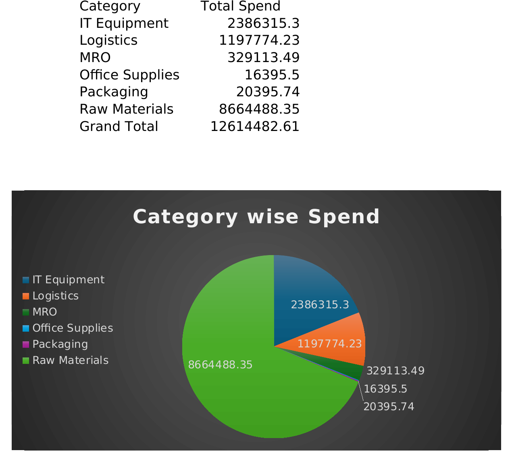

Item categories down the rows with total spend in dollars, from IT Equipment ($2,386,315) and Logistics ($1,197,774) through MRO, Office Supplies and Packaging to Raw Materials ($8,664,488). The pivot chart, Category wise Spend, is a pie of the same values.

### Pivot 4: spend by month

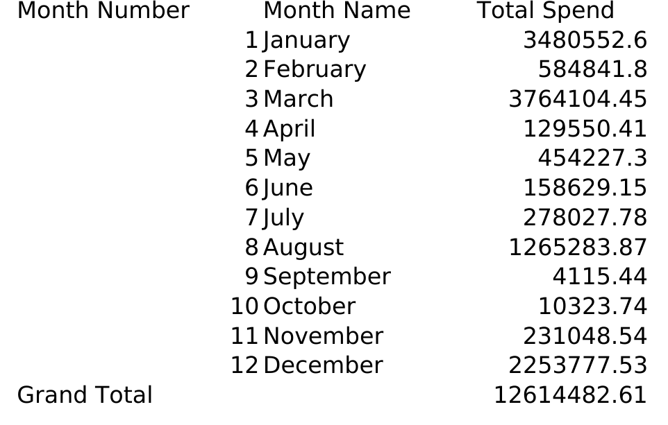

A two-level row layout with month number and month name, so the months sort in calendar order (January to December) instead of alphabetically. It is the source for the monthly trend and for every month-by-month calculation downstream.

### Pivot chart: month by spend trend

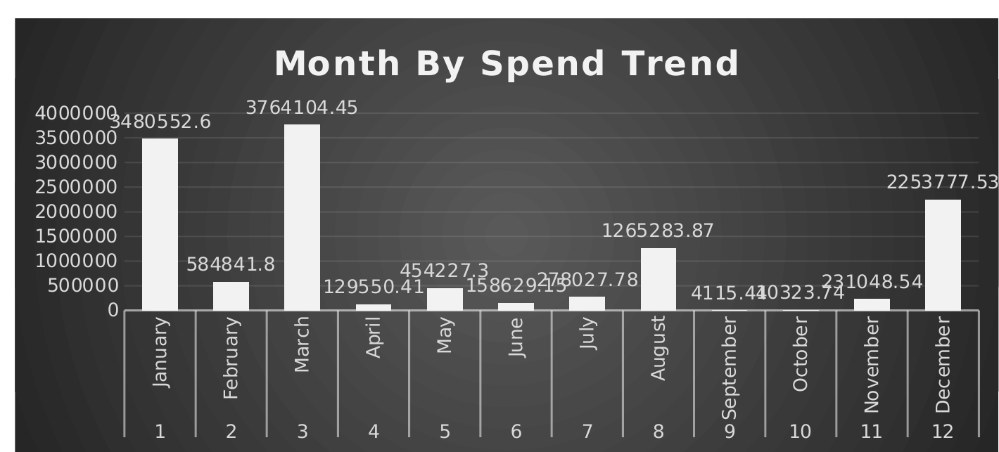

A column chart of the monthly pivot, with data labels on each column. It is the working version of the trend that the dashboard later redraws with the monthly average line.

### Slicers

Four slicers sit beside the pivots and are connected to every pivot table through a shared cache: **Quarter**, **Year**, **Region** and **Vendor Name**. Clicking a region or a vendor re-cuts all four pivots and all three pivot charts at the same moment, which makes it easy to ask questions such as how one vendor's spend splits across departments.

## Dashboard Data sheet

The Dashboard Data sheet is the plumbing between the pivots and the dashboard. It reads from Sheet2 and reshapes the numbers into clean, contiguous ranges, because charts work best from tidy blocks of cells.

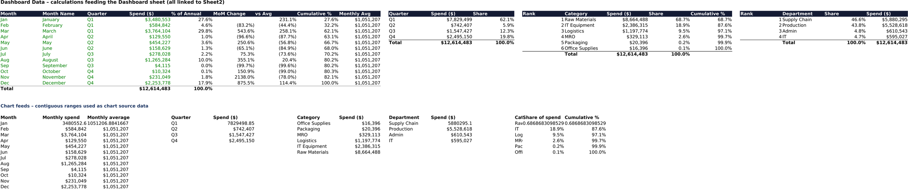

### Calculations

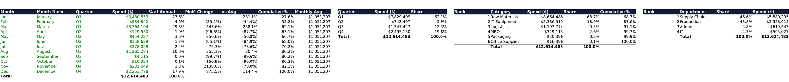

Four calculated blocks: a monthly table (month, quarter, spend, percent of annual, month-over-month change, difference from average, cumulative percent and the monthly average), a quarterly summary, a category ranking with cumulative share, and a department ranking. These are the source for the Details sheet.

### Chart feeds

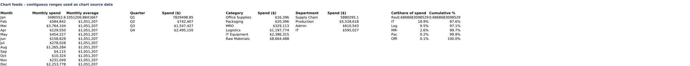

Below the calculations sits a second group of ranges named for what they feed: monthly spend with its average line, quarterly spend, category spend sorted for the bar chart, department spend, and category share with cumulative share for the Pareto chart. Each dashboard chart points at one of these blocks.

## Key findings

- Spend is **highly concentrated**. One category takes 68.7%, the top three take 97.1%, and two departments take 90.4%.
- Spend is **highly irregular**. The monthly coefficient of variation is 1.24, the top three months make up 75.3% of the year, and September costs $4,115 against March's $3.76M.
- The year is **front-loaded**. First-half spend is 68.0% of the total and Q1 alone is 62.1%.
- Purchasing is **high value and low volume**: 30 orders at a $420.5K average, so each one carries real financial weight.
- The long tail is **negligible**: categories under 1% each total only 0.3%, which points to process savings rather than negotiation.
- The clearest actions are to bring **Raw Materials** under multi-supplier contracts with price-indexation clauses, to put approval and bidding thresholds on large orders, and to use the quiet third quarter for supplier negotiations.

## How the pieces connect

The flow runs in one direction. Power Query loads the five source tables into the data model. The model's measures feed the four pivot tables on Sheet2, and the slicers filter all of them together. The Dashboard Data sheet reads from those pivots and reshapes the results. The Details sheet and the Dashboard charts then read from Dashboard Data. Nothing downstream of the pivots is hard-coded, so refreshing the model updates every number, chart and percentage in the workbook.

## How to use the file

1. Download [`data/Spend_Cost_Analysis.xlsx`](data/Spend_Cost_Analysis.xlsx) and open it in desktop Excel. The data model, pivot tables and slicers need Excel 2013 or later on Windows or a recent Excel for Mac. Other spreadsheet programs can open the file but may not display the slicers or refresh the model.
2. Start on the **Dashboard** sheet for the summary.
3. Go to **Details** for the tables and risk indicators.
4. Go to **Sheet2** and click the slicers to filter by quarter, year, region or vendor. Every pivot and pivot chart updates together.
5. To refresh after the source data changes, use Data > Refresh All. The downstream sheets recalculate from the pivots.

The screenshots in this repository are static exports of each sheet. The slicers and the data model only work inside the workbook itself.

## Repository layout

```
procurement-analysis/
├── README.md
├── .gitignore
├── data/
│   └── Spend_Cost_Analysis.xlsx
└── screenshots/
    ├── 01-dashboard-overview.png
    ├── 02-kpi-cards.png
    ├── 03-monthly-spend-vs-average.png
    ├── 04-spend-by-quarter.png
    ├── 05-spend-by-category.png
    ├── 06-spend-by-department.png
    ├── 07-category-pareto.png
    ├── 08-key-insights.png
    ├── 09-details-sheet-overview.png
    ├── 10-details-monthly-spend.png
    ├── 11-details-category-ranking.png
    ├── 12-details-department-ranking.png
    ├── 13-details-risk-indicators.png
    ├── 14-details-key-metrics.png
    ├── 15-pivot-kpi-measures.png
    ├── 16-pivot-spend-by-department.png
    ├── 17-pivot-spend-by-category.png
    ├── 18-pivot-spend-by-month.png
    ├── 19-pivot-chart-month-trend.png
    ├── 20-dashboard-data-calculations.png
    ├── 21-dashboard-data-chart-feeds.png
    ├── 22-pivot-sheet-overview.png
    └── 23-dashboard-data-overview.png
```

## Author

Romith
GitHub: [@ismam-tasnime](https://github.com/ismam-tasnime)
